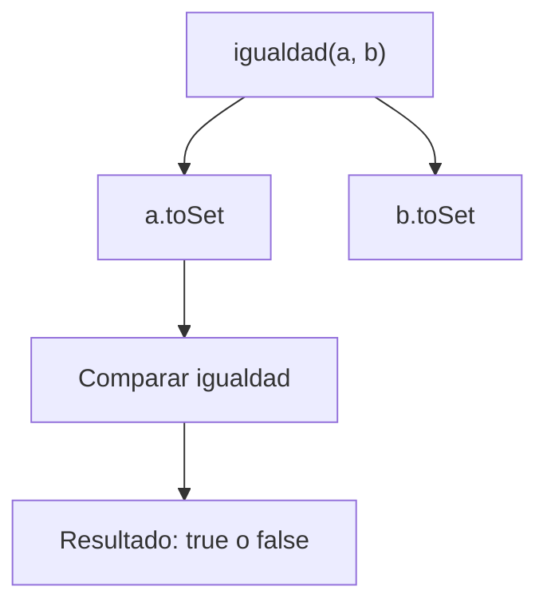
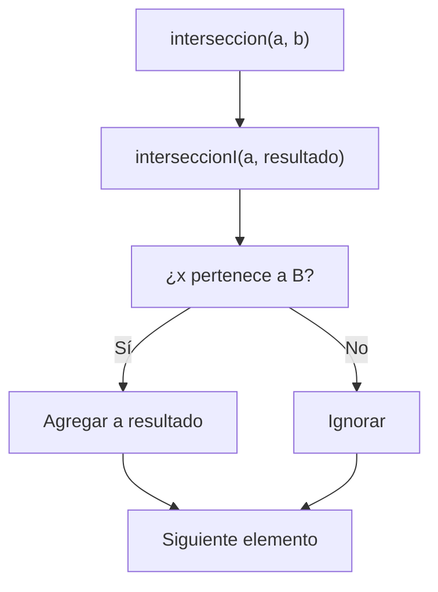
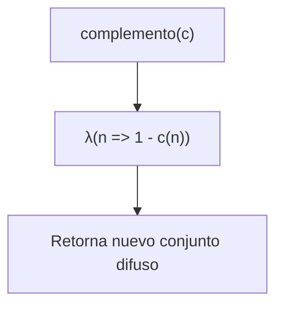

# **Taller 2 — Programación Funcional y Conjuntos en Scala**

**Autores:**  
- Bryan Steven Ospina Ramírez  
- López Botero Karen Sofía  
- Arce Jaramillo Jhorian David  

---

## **Introducción**

Este taller tiene como propósito afianzar el uso de la programación funcional en Scala mediante la implementación de operaciones sobre conjuntos clásicos y difusos.  
Los objetivos principales incluyen:  
1. Implementar funciones puras utilizando recursión y colecciones inmutables.  
2. Aplicar conceptos matemáticos de teoría de conjuntos en la práctica funcional.  
3. Validar los resultados a través de pruebas unitarias automatizadas.  

A continuación, se documenta cada una de las funciones desarrolladas, su razonamiento, los diagramas de pila, la notación matemática que las respalda y un informe de corrección técnica.

---

## **1. Igualdad**

### **Descripción**
La función `igualdad` determina si dos conjuntos son iguales, independientemente del orden o de elementos duplicados. Para ello, las listas se transforman en conjuntos (`Set`), aprovechando su naturaleza inmutable y no repetitiva.

### **Implementación**
```scala
package taller2

class Igualdad {
  def igualdad(a: List[Int], b: List[Int]): Boolean = {
    a.toSet == b.toSet
  }
}
```

### **Notación Matemática**
A = B ⟺ (∀x ∈ A ⇒ x ∈ B) ∧ (∀x ∈ B ⇒ x ∈ A)

### **Diagrama de Pila (Mermaid)**


### **Informe de Corrección**
La función cumple los principios de programación funcional:
- No utiliza variables mutables.
- No depende del orden de los elementos.
- Se basa en la semántica matemática de los conjuntos.

Los casos de prueba verifican igualdad en diferentes órdenes, conjuntos vacíos y conjuntos distintos.

---

## **2. Inclusión**

### **Descripción**
La función `inclusion` verifica si el conjunto A está contenido en B.

### **Implementación**
```scala
package taller2

class Inclusion {
  def inclusion(a: List[Int], b: List[Int]): Boolean = {
    a.toSet.subsetOf(b.toSet)
  }
}
```

### **Notación Matemática**
A ⊆ B ⟺ (∀x ∈ A ⇒ x ∈ B)

### **Diagrama de Pila (Mermaid)**
```mermaid
graph TD
  A["inclusion(a, b)"] --> B["a.toSet"]
  A --> C[b.toSet]
  B --> D[subsetOf(b)]
  D --> E[Retorna true o false]
```

### **Informe de Corrección**
- El uso de `subsetOf` simplifica la verificación matemática.  
- Los casos de prueba validan inclusión total, parcial, igualdad, vacíos y no inclusión.

---

## **3. Unión**

### **Descripción**
La función `union` devuelve un nuevo conjunto con todos los elementos que aparecen en A o B, sin duplicados.

### **Implementación**
```scala
package taller2
import scala.annotation.tailrec

class Union {
  def union(a: List[Int], b: List[Int]): List[Int] = {
    @tailrec
    def unionI(c: List[Int], resultado: List[Int]): List[Int] =
      c match {
        case Nil => resultado
        case x :: xs =>
          if (resultado.contains(x))
            unionI(xs, resultado)
          else
            unionI(xs, resultado :+ x)
      }
    unionI(a ++ b, List())
  }
}
```

### **Notación Matemática**
A ∪ B = {x | x ∈ A ∨ x ∈ B}

### **Diagrama de Pila (Mermaid)**
```mermaid
graph TD
  A["union(a, b)"] --> B["concat(a, b)"]
  B --> C[unionI(c, resultado)]
  C --> D[¿x ya está en resultado?]
  D -->|Sí| E[Ignorar elemento]
  D -->|No| F[Agregar x a resultado]
  E --> G[Siguiente elemento]
  F --> G
```

### **Informe de Corrección**
- La recursión de cola evita desbordamientos.  
- No se usan ciclos ni variables mutables.  
- Los casos de prueba confirman el manejo de duplicados y listas vacías.

---

## **4. Intersección**

### **Descripción**
La función `interseccion` genera un conjunto con los elementos comunes entre A y B.

### **Implementación**
```scala
package taller2
import scala.annotation.tailrec

class Interseccion {
  def interseccion(a: List[Int], b: List[Int]): List[Int] = {
    @tailrec
    def interseccionI(c : List[Int], resultado: List[Int]): List[Int] =
      c match {
        case Nil => resultado
        case x :: xs =>
          if (b.contains(x) && !resultado.contains(x))
            interseccionI(xs, resultado :+ x)
          else
            interseccionI(xs, resultado)
      }
    interseccionI(a, List())
  }
}
```

### **Notación Matemática**
A ∩ B = {x | x ∈ A ∧ x ∈ B}

### **Diagrama de Pila (Mermaid)**


### **Informe de Corrección**
- Cumple los principios de inmutabilidad y pureza funcional.  
- La lógica elimina duplicados y trabaja correctamente con listas vacías y listas idénticas.

---

## **5. Grande (Conjuntos Difusos)**

### **Descripción**
Define una función de pertenencia difusa μ(x) que mide el grado de “grandeza” de un elemento.

### **Implementación**
```scala
package taller

class Grande {
  type ConjDifuso = Int => Double

  def grande(d: Int, e: Int): ConjDifuso = {
    (n: Int) =>
      if (n <= 0) 0.0
      else math.pow(n.toDouble / (n + d).toDouble, e.toDouble)
  }

  def union(a: ConjDifuso, b: ConjDifuso): ConjDifuso =
    (n: Int) => math.max(a(n), b(n))

  def interseccion(a: ConjDifuso, b: ConjDifuso): ConjDifuso =
    (n: Int) => math.min(a(n), b(n))

  def complemento(a: ConjDifuso): ConjDifuso =
    (n: Int) => 1.0 - a(n)
}
```

### **Notación Matemática**
μA∪B(x) = max(μA(x), μB(x))  
μA∩B(x) = min(μA(x), μB(x))  
μ¬A(x) = 1 − μA(x)

### **Diagrama de Pila (Mermaid)**
```mermaid
graph TD
  A["grande(d,e)"] --> B["λ(n => (n/(n+d))^e)"]
  A --> C[union(a,b)]
  A --> D[interseccion(a,b)]
  A --> E[complemento(a)]
```

### **Informe de Corrección**
- Aplica correctamente las definiciones de teoría de conjuntos difusos.  
- Se verificó su funcionamiento con valores límites y operaciones combinadas.

---

## **6. Complemento (Conjuntos Difusos)**

### **Descripción**
La función `complemento` devuelve el complemento de un conjunto difuso.

### **Implementación**
```scala
package taller

class Complemento {
  type ConjDifuso = Int => Double

  def complemento(c: ConjDifuso): ConjDifuso = {
    (n: Int) => 1.0 - c(n)
  }
}
```

### **Notación Matemática**
μ¬A(x) = 1 − μA(x)

### **Diagrama de Pila (Mermaid)**


### **Informe de Corrección**
- Cumple con la definición clásica del complemento difuso.  
- Los casos de prueba validan límites y coherencia con la función original.
